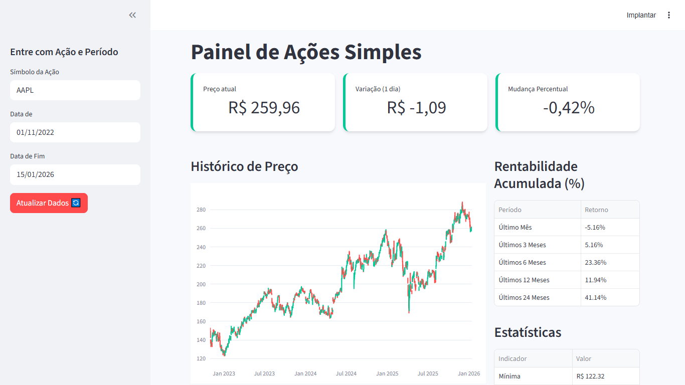

# 📊 Painel de Ações Simples (Stock Dashboard)


Um dashboard financeiro interativo desenvolvido em Python para análise histórica de ativos listados na bolsa de valores. O projeto consome dados reais via Yahoo Finance e apresenta visualizações profissionais utilizando Plotly e Streamlit.



## 🚀 Funcionalidades

* **KPIs em Tempo Real:** Exibição do preço atual, variação em reais e variação percentual do último dia de pregão.
* **Gráfico de Velas (Candlestick):** Visualização interativa com Plotly, permitindo zoom e análise detalhada da movimentação de preços.
* **Análise de Rentabilidade:** Tabela dinâmica que calcula automaticamente o retorno do ativo em diferentes períodos (1 mês, 3 meses, 6 meses, 1 ano e 2 anos).
* **Estatísticas Gerais:** Resumo de mínima, máxima e volume médio do período selecionado.
* **Filtros Personalizáveis:** Barra lateral para seleção de qualquer ticker (ex: PETR4.SA, AAPL, VALE3.SA) e intervalo de datas.

## 🛠️ Tecnologias Utilizadas

* **Python:** Linguagem principal.
* **Streamlit:** Framework para construção da interface web e dashboard.
* **Yfinance:** Biblioteca para extração de dados financeiros do Yahoo Finance.
* **Plotly:** Biblioteca para criação de gráficos interativos e profissionais.
* **Pandas:** Manipulação e tratamento de dados tabulares.

## 📦 Como rodar o projeto localmente

Siga os passos abaixo para executar o dashboard na sua máquina:

1. **Clone o repositório:**
   ```bash
   git clone [https://github.com/gicarlos2025/stock_analyzer](https://https://github.com/seu_usuario/stock_analyzer)
   cd stock_analyzer
